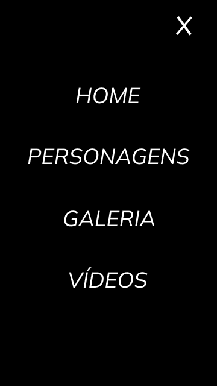

# Doctor Strange
Projeto construido durante as aulas de LIMA, no [SENAI Jandira](https://jandira.sp.senai.br/), com orientação do Prof. [Fernando Leonid](href="https://github.com/fernandoleonid)

---

## Qual era o objetivo do projeto?
O objetivo era criar uma landing page com base no design feito no figma, aprendendo a estrutura do HTML, CSS, JS  e conceitos de responsividade.

---

## O que é Landing Page?
Landing Pages são paginas com foco principal na conversão de visitantes, assim, essas páginas possuem uma estetica mais minimalista, comparada com os sites mais tradicionais.

---

## Tecnologias usadas
- HTML 5
- CSS 2
- Javascript
- Figma

---

## Links
- [Resultado](https://isabellematos.github.io/doctor-strange02/)
- [Projeto no Figma](https://www.figma.com/file/0TAASxA1nG4RfmHzKP9KVx/LIMA---DR.STRANGE-2?node-id=7%3A91)
- [Código](https://github.com/isabellematos/doctor-strange02)

---
## Autor

Me chamo [Isabelle](https://github.com/isabellematos), tenho 16 anos, atualmente cursando Técnico em Desenvolvimento de Sistemas no SENAI Jandira.
